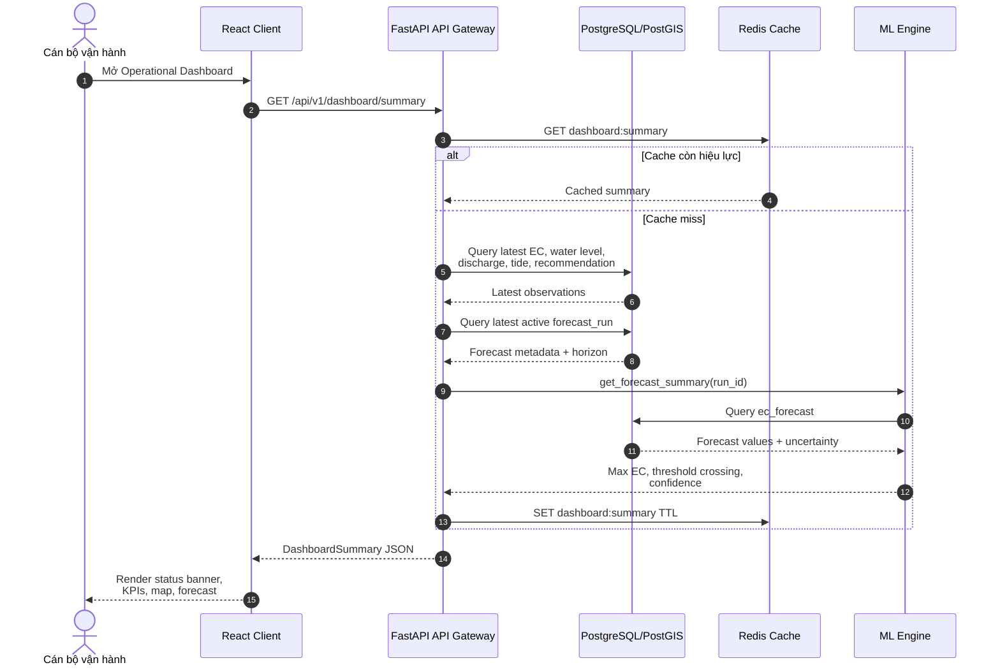
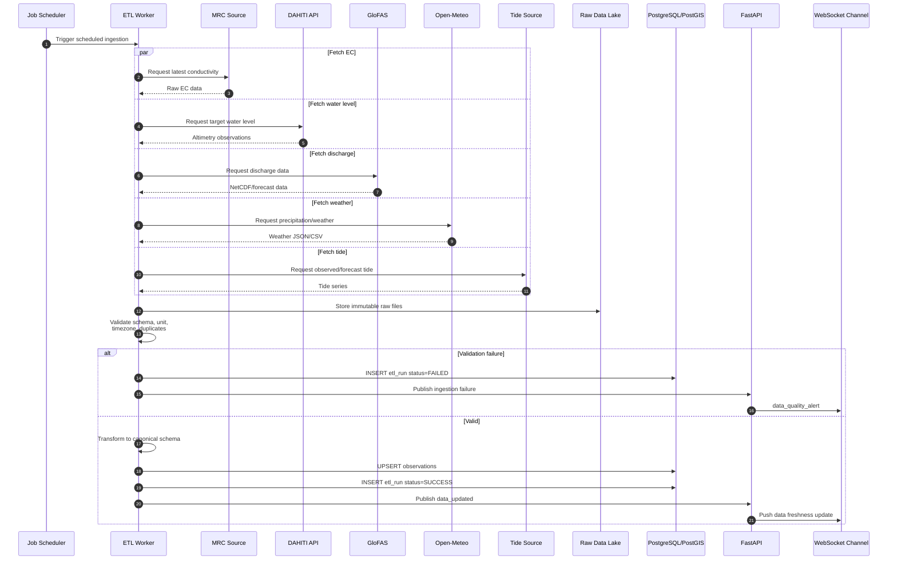
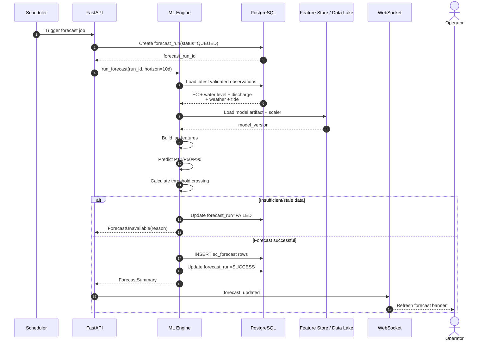
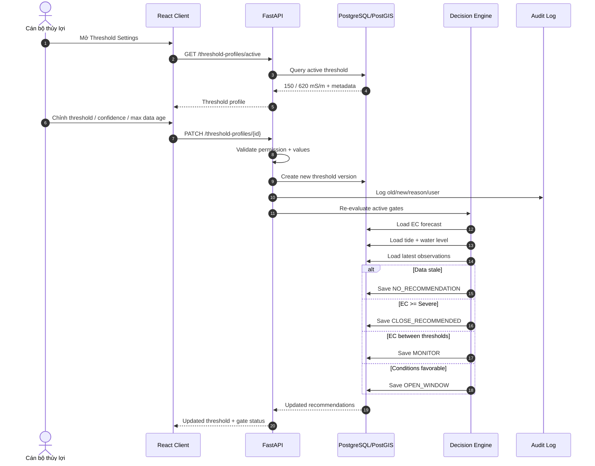
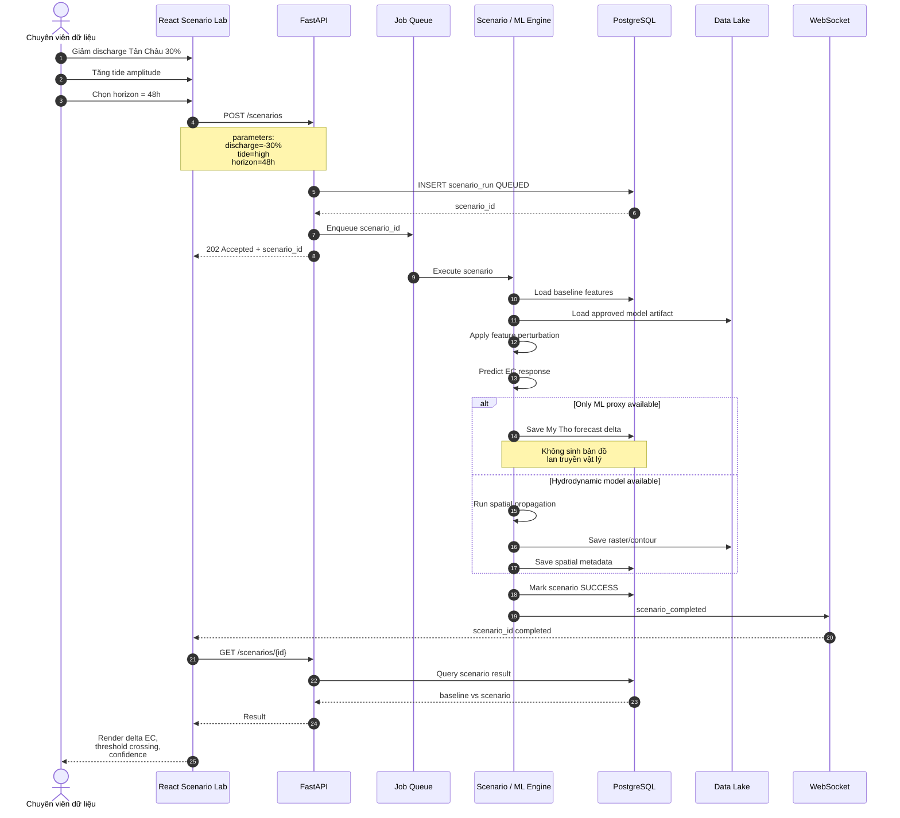
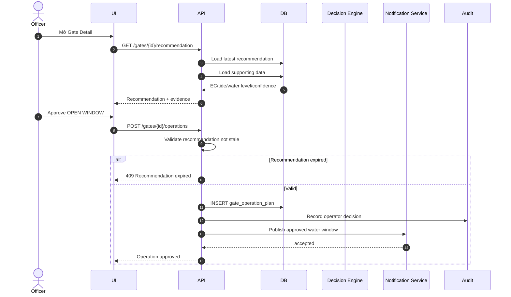
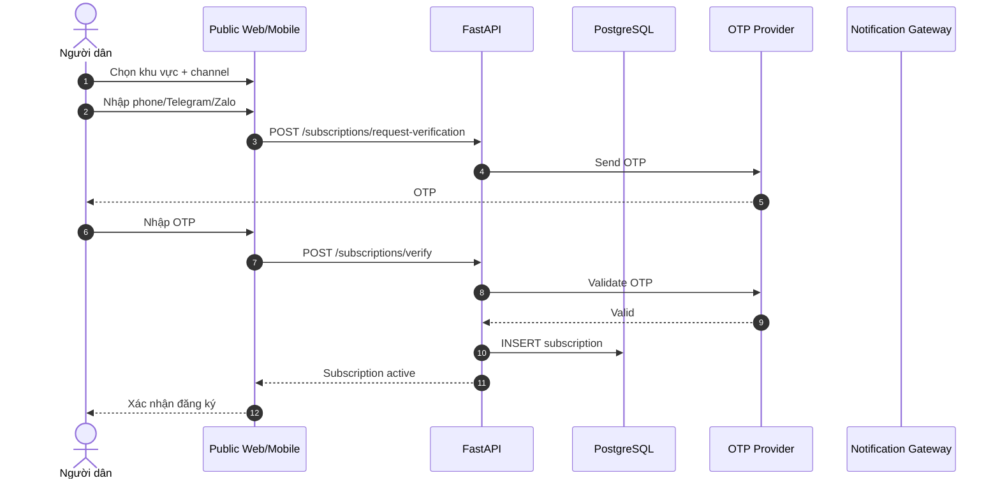
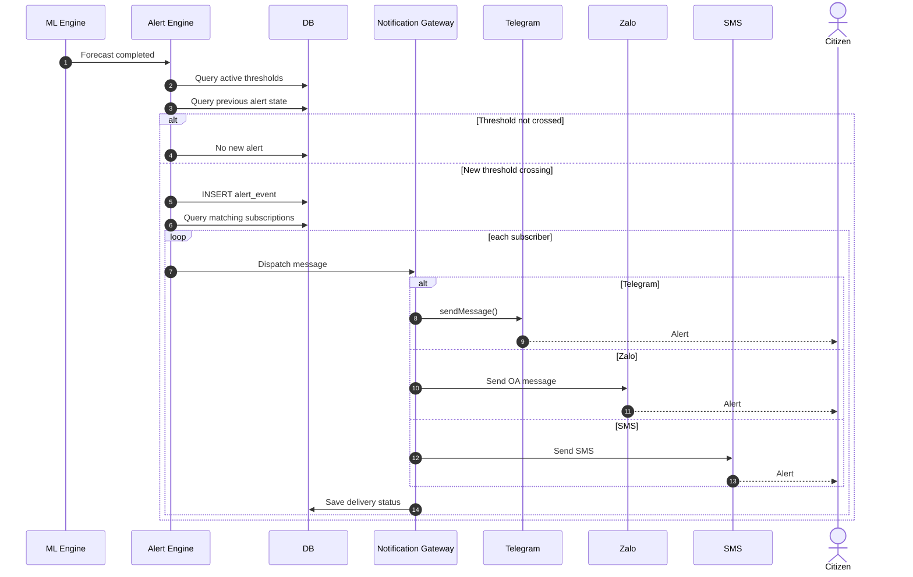
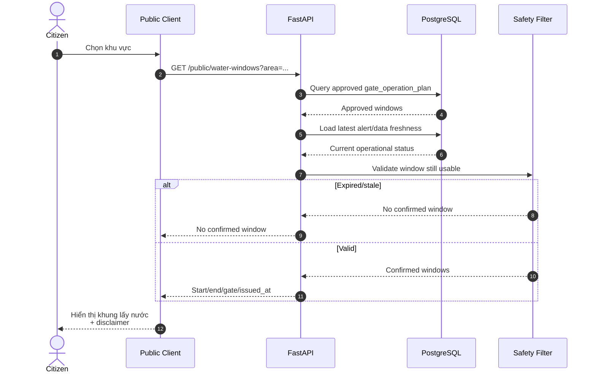
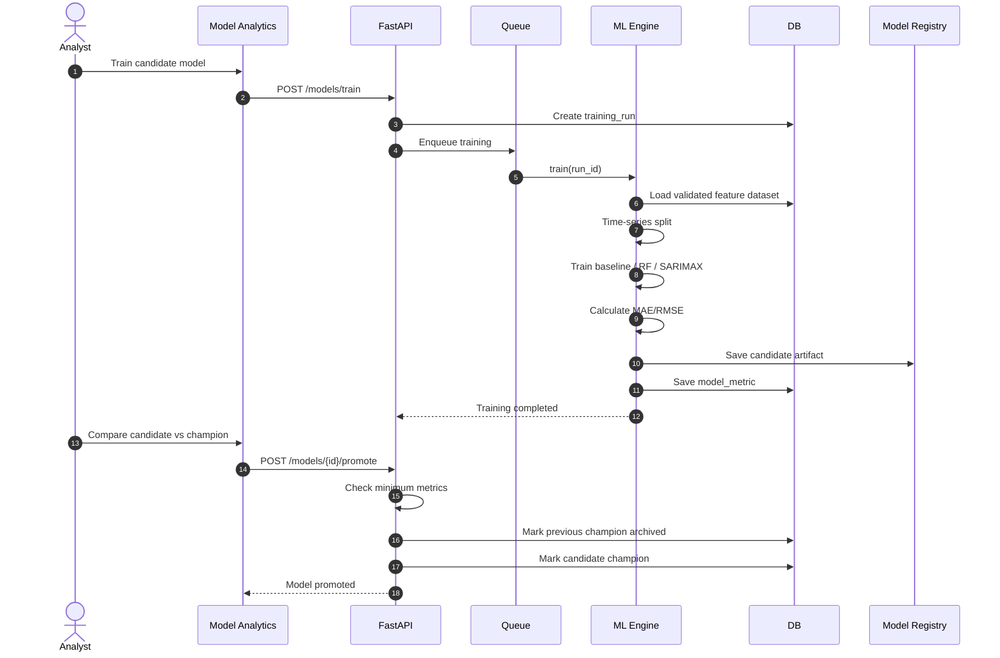

# THIẾT KẾ TOÀN DIỆN HỆ THỐNG GIÁM SÁT, DỰ BÁO VÀ CẢNH BÁO SỚM XÂM NHẬP MẶN ĐỒNG THÁP

## 0. Nguyên tắc thiết kế và các hiệu chỉnh bắt buộc

### 0.1. Dữ liệu thực tế hiện có trong project

Sau khi rà soát codebase, hệ thống hiện có các nhóm dữ liệu sau:

| Nguồn | Dữ liệu thực tế trong project | Độ phân giải hiện tại | Vai trò đề xuất |
|---|---|---|---|
| MRC | Conductivity/EC tại Tân Châu và Mỹ Tho | Gốc chủ yếu theo tháng | Target lịch sử và phân tích xu hướng |
| DAHITI | Water level + sai số đo tại ID 627 và 3316 | Không đều theo thời gian | Feature thủy văn bổ trợ |
| GloFAS | River discharge dạng NetCDF | Dữ liệu lịch sử 1985–2023 | Feature thượng nguồn |
| Open-Meteo | Precipitation, nhiệt độ max/min/mean, ET₀, gió cực đại, RH, shortwave radiation | Daily | Khí tượng/feature ngoại sinh |
| Spatial | KML tọa độ MRC | Tĩnh | Vị trí trạm |
| Processed | `master_timeseries.csv/parquet` | Monthly | Training dataset hiện tại |

Dữ liệu Open-Meteo trong project không chỉ có mưa mà còn có:

- nhiệt độ trung bình;
- nhiệt độ cực đại/cực tiểu;
- ET₀;
- tốc độ gió;
- độ ẩm;
- bức xạ sóng ngắn.

Open-Meteo Historical API sử dụng các sản phẩm reanalysis như ERA5/ERA5-Land; đây là dữ liệu mô hình/reanalysis chứ không phải cảm biến khí tượng tại trạm.

DAHITI cung cấp mực nước từ satellite altimetry. Độ phân giải thời gian phụ thuộc quỹ đạo vệ tinh, có thể ở mức khoảng 10–35 ngày và dữ liệu near-real-time có thể trễ 1–2 ngày. Vì vậy **DAHITI không nên được dùng trực tiếp để xác định giờ đóng/mở cống theo triều trong ngày**.

---

## 0.2. Các điểm phải sửa về kỹ thuật

### A. Không gọi EC là salinity trong code

Các tên sau cần loại bỏ:

```text
salinity_lag_1
/salinity/history
SalinityRecord
```

Thay bằng:

```text
ec_lag_1
/ec/history
ConductivityRecord
```

Target thực tế là:

```text
Electrical Conductivity
Unit = mS/m
```

---

### B. Hai ngưỡng cảnh báo nên lưu trực tiếp dưới dạng EC

MRC State of the Basin Report 2023 sử dụng hai ngưỡng chỉ báo tại Mỹ Tho:

```text
1 g/L  ↔ EC ≈ 150 mS/m
4 g/L  ↔ EC ≈ 620 mS/m
```


Do đó hệ thống **không cần dùng công thức EC → salinity tự chế**.

Thiết lập profile mặc định:

```text
MRC_MYTHO_REFERENCE

NORMAL:
EC < 150 mS/m

WATCH:
150 ≤ EC < 620 mS/m

SEVERE:
EC ≥ 620 mS/m
```

Giao diện phải ghi:

> “Ngưỡng tham chiếu MRC tại Mỹ Tho”

không ghi:

> “Công thức quy đổi độ mặn”.

---

### C. Forecast 3–10 ngày chưa thể đánh giá bằng dataset hiện tại

Target EC hiện tại có temporal resolution chủ yếu theo **tháng**.

Do đó:

```text
Forecast 3 ngày
Forecast 5 ngày
Forecast 10 ngày
```

chưa thể được huấn luyện và kiểm chứng nghiêm túc bằng target hiện tại.

Hệ thống nên có hai mode:

```text
RESEARCH MODE
Monthly historical analysis

OPERATIONAL PILOT
Daily/sub-daily forecast
```

Operational Pilot chỉ được bật khi có dữ liệu EC đủ dày theo ngày hoặc giờ.

---

### D. Cross-correlation hiện tại là lag tháng

Code hiện tại:

```text
lag = 0 → 6 tháng
```

Vì vậy UI phải gọi nó là:

> “Tương quan trễ lịch sử theo tháng”

không phải:

> “Thời gian truyền mặn Tân Châu → Mỹ Tho”.

Khi chuyển sang operational model cần tính:

```text
lag 1 ngày
lag 2 ngày
...
lag 14 ngày
```

hoặc sub-daily nếu dữ liệu đủ tốt.

---

### E. GloFAS cần sửa cách trích dữ liệu

Code hiện tại có logic tương đương:

```python
ds[var].mean(dim=[lat, lon])
```

Điều này đang lấy **trung bình không gian của grid tải về**.

Đối với Tân Châu, cần thay bằng:

```text
tọa độ Tân Châu
       ↓
nearest valid river grid / mapped river reach
       ↓
extract discharge
```

không được coi trung bình toàn bbox là:

> “Lưu lượng Tân Châu”.

Ngoài historical reanalysis, GloFAS hiện có medium-range forecast horizon tới khoảng 15 ngày, do đó về nguyên tắc có thể cung cấp feature phù hợp cho horizon 3–10 ngày khi hệ thống chuyển sang operational mode.

---

### F. Chưa có dữ liệu triều trong file hiện tại

Do đó tính năng:

> “Đóng/mở cống theo lịch triều”

cần bổ sung một nguồn:

```text
Tide Forecast / Observed Tide Service
```

tại vị trí đại diện phù hợp cho khu vực hạ lưu sông Tiền.

Không được suy ra lịch triều từ DAHITI.

---

# 1. PRODUCT VISION

Hệ thống không nên được thiết kế như một dashboard khoa học đơn thuần.

Nó cần phục vụ ba câu hỏi:

### Đối với cán bộ thủy lợi

> Trong 24 giờ tới và 3–10 ngày tới, cống nào cần chú ý và thời điểm nào có thể xem xét lấy nước?

### Đối với chuyên viên dữ liệu

> Điều gì đang khiến nguy cơ mặn thay đổi và kịch bản nào làm tình hình xấu hơn?

### Đối với người dân

> Khu vực của tôi đang ở mức cảnh báo nào và khi nào có khung thời gian lấy nước được cơ quan vận hành công bố?

---

# 2. PERSONAS VÀ QUYỀN HỆ THỐNG

## 2.1. Cán bộ vận hành thủy lợi

Quyền:

```text
VIEW operational dashboard
VIEW forecast
VIEW gates
EDIT threshold profile
VIEW recommendation
APPROVE operation plan
OVERRIDE recommendation
CREATE public alert
```

Không được:

```text
thay đổi model
thay dữ liệu nguồn
```

---

## 2.2. Chuyên viên khí tượng/dữ liệu

Quyền:

```text
VIEW all data
VIEW data quality
RUN scenario
RUN model
COMPARE models
VIEW cross-correlation
VIEW feature importance
EXPORT data
```

Không được tự động thay đổi trạng thái vận hành cống.

---

## 2.3. Quản trị dữ liệu / System Admin

Bổ sung persona này.

Quyền:

```text
manage source
manage users
manage model versions
approve datasets
view ETL failures
manage notification integrations
```

---

## 2.4. Nông dân / hộ sử dụng nước

Không cần dashboard phức tạp.

Chỉ cần:

```text
vị trí/khu vực
mức cảnh báo
khung lấy nước được công bố
đăng ký thông báo
lịch sử cảnh báo gần nhất
```

---

# 3. INFORMATION ARCHITECTURE

Sidebar desktop:

```text
TỔNG QUAN
├─ Trung tâm giám sát
├─ Bản đồ xâm nhập mặn

VẬN HÀNH
├─ Cống thủy lợi
├─ Khuyến nghị
├─ Kế hoạch vận hành
└─ Cảnh báo

PHÂN TÍCH
├─ Dự báo 3–10 ngày
├─ Tương quan trễ
├─ Scenario Lab
└─ Model Analytics

DỮ LIỆU
├─ Trạm quan trắc
├─ Data Quality
├─ ETL Jobs
└─ Nguồn dữ liệu

CỘNG ĐỒNG
├─ Khung lấy nước
├─ Đăng ký cảnh báo
└─ Nhật ký gửi thông báo

HỆ THỐNG
├─ Threshold Profiles
├─ Model Registry
├─ Users & Roles
└─ Audit Log
```

---

# 4. UI/UX DASHBOARD SPECIFICATION

# 4.1. Màn hình 01 – Trung tâm giám sát

URL:

```text
/overview
```

## Header

```text
[Đồng Tháp SalinityWatch]

Trung tâm giám sát

Cập nhật dữ liệu:
MRC       14/09 08:00
GloFAS    22/09 00:00
Weather   22/09 01:00
Tide      22/09 01:00
```

Luôn có **Data Freshness** vì cảnh báo từ dữ liệu cũ rất nguy hiểm.

---

## Status Banner

Ví dụ:

```text
⚠ CẢNH BÁO MỨC 2 – THEO DÕI

Mỹ Tho
EC forecast max 5 ngày: 428 mS/m

Ngưỡng tham chiếu:
150 mS/m → Watch
620 mS/m → Severe

Model confidence: 78%
```

Không chỉ dùng màu.

Phải có:

```text
icon
label
value
description
```

---

## KPI Cards

### Card 1 – EC Mỹ Tho hiện tại

```text
EC hiện tại
132 mS/m

↓ 8% so với kỳ trước
```

### Card 2 – Forecast Maximum

```text
Max EC – 7 ngày
428 mS/m

Ngày cực đại:
26/09
```

### Card 3 – Upstream Flow

```text
Tân Châu
Discharge

8,520 m³/s
↓ 14%
```

### Card 4 – Water Level

```text
DAHITI Mỹ Tho
1.92 m

Data age:
12 days
```

Data age phải hiển thị vì DAHITI không phải realtime gauge.

---

# 4.2. Main Map

Chiếm khoảng:

```text
60–65% viewport
```

Layer:

```text
✓ Trạm quan trắc
✓ Cống
✓ EC forecast
✓ Risk zones
□ Rainfall
□ River discharge
□ Water level
□ Tide
```

---

## Station Symbol

Tân Châu:

```text
▲
UPSTREAM
```

Mỹ Tho:

```text
●
DOWNSTREAM TARGET
```

---

## Popup Mỹ Tho

```text
TRẠM MỸ THO

EC:
186 mS/m

MRC Reference:
Watch

Forecast +3d:
242 mS/m

Forecast +7d:
381 mS/m

Data source:
MRC

[View time series]
[View forecast]
```

---

# 4.3. Timeline Slider

Dưới bản đồ:

```text
Observed                Forecast
─────────────│────────────────────
  -48h       NOW     +3d  +5d  +7d +10d
```

Có nút:

```text
▶ Play
```

để animation.

---

# 4.4. Forecast Panel

Chart:

```text
EC (mS/m)
700 ─────────── 4 g/L reference
620 ───────────
       forecast band
400       ╭───────╮
300 ─────╯       ╰──
150 ─────────── 1 g/L reference
0
  now  +1 +2 +3 ... +10d
```

Hiển thị:

```text
P50 forecast
P10–P90 uncertainty band
observed
threshold 150
threshold 620
```

Không chỉ hiển thị một đường forecast duy nhất.

---

# 4.5. Drivers Panel

Tên:

> “Yếu tố đang ảnh hưởng dự báo”

Ví dụ:

```text
↓ Upstream discharge
   Strong negative relationship

↑ Tide
   High impact

↓ Rainfall
   Medium impact

Water level
   Low/uncertain
```

Không diễn giải SHAP/feature importance thành quan hệ nhân quả.

---

# 4.6. Cross-Correlation Screen

URL:

```text
/analytics/lag
```

Header:

> Tương quan trễ Tân Châu → Mỹ Tho

Chart:

```text
Correlation

0.0
-0.2   █
-0.4      █
-0.6         █
-0.8            █

       Lag
1d 2d 3d ... 
```

Trong Research Mode hiện tại:

```text
Lag unit = MONTH
```

Banner bắt buộc:

> “Phân tích hiện sử dụng dữ liệu monthly; không diễn giải lag này là thời gian truyền thực tế của nước.”

---

# 5. CỔNG THỦY LỢI / GATE OPERATIONS

URL:

```text
/gates
```

Table:

| Cống | Forecast EC | Tide | Recommendation | Confidence | Operator |
|---|---:|---|---|---:|---|
| Gate A | 121 | Falling | OPEN WINDOW | 86% | Pending |
| Gate B | 187 | Rising | MONITOR | 75% | Pending |
| Gate C | 650 | Rising | CLOSE | 91% | Approved |

Không gọi recommendation là:

> “Gate Status”

vì hệ thống không trực tiếp điều khiển cống.

---

## Gate Detail Drawer

```text
CỐNG VÀM GIỒNG

Recommendation:
CLOSE

Reason:
Forecast EC = 652 mS/m
Threshold = 620 mS/m
Tide = rising

Forecast horizon:
6h

Confidence:
91%

Data freshness:
GloFAS: 2h
Tide: 30m
EC: 1h

[Approve]
[Reject]
[Override]
```

---

## Manual Override

Operator chọn:

```text
OPEN
CLOSE
HOLD
```

Bắt buộc nhập:

```text
Reason
```

Ví dụ:

> “Nội đồng đang thiếu nước; sử dụng quan trắc tại chỗ mới nhất.”

Lưu audit:

```text
operator
timestamp
old recommendation
new decision
reason
```

---

# 6. DECISION ENGINE

Không nên dùng rule:

```text
EC < threshold
→ OPEN
```

đơn giản.

Logic đề xuất:

```text
IF data stale
    → NO_RECOMMENDATION

ELSE IF model confidence low
    → MONITOR

ELSE IF forecast EC >= Severe threshold
    → CLOSE_RECOMMENDED

ELSE IF forecast EC >= Watch threshold
    → MONITOR

ELSE IF EC < gate safe threshold
    AND tide condition acceptable
    AND hydraulic condition acceptable
    AND minimum safe duration >= configured duration
    → OPEN_WINDOW

ELSE
    → HOLD
```

---

# 7. THRESHOLD SETTINGS

URL:

```text
/settings/thresholds
```

Profile:

```text
MRC_MYTHO_REFERENCE
```

Fields:

```text
Watch EC:
150 mS/m

Severe EC:
620 mS/m

Minimum forecast confidence:
70%

Minimum safe window:
120 min

Maximum data age:
180 min
```

Bên cạnh threshold:

> Source: MRC State of the Basin Report 2023

Không cho người dùng sửa mà không ghi:

```text
reason
effective date
approved by
```

---

# 8. USER FLOW 1 – CÁN BỘ TRẠM THỦY LỢI

## Mục tiêu

Thiết lập ngưỡng và theo dõi khuyến nghị vận hành.

### Flow

```text
Login
↓
Operational Dashboard
↓
Review data freshness
↓
Select gate
↓
Review:
 EC forecast
 tide
 water level
 confidence
↓
System recommendation
↓
Approve / Override
↓
Create operation plan
↓
Publish safe-water window
↓
Notify subscribers
```

### Trường hợp ngoại lệ

Nếu:

```text
Data freshness > configured limit
```

UI hiển thị:

```text
⚠ Recommendation unavailable
Reason: stale data
```

Không được tự động giữ recommendation cũ.

---

# 9. USER FLOW 2 – CHUYÊN VIÊN KHÍ TƯỢNG / DATA

URL:

```text
/scenario-lab
```

## Scenario Controls

```text
Upstream discharge
-50% ─────●──── +30%

Rainfall
0% ───────●──── 200%

Tide amplitude
-0.3m ────●──── +0.5m

Initial EC
80 ───────●──── 700 mS/m

Horizon
[48h] [72h] [7d] [10d]
```

Preset:

```text
[Dry Season]
[Low Flow]
[High Tide]
[Compound Event]
```

---

## Quan trọng: chia hai loại scenario

### Proxy Scenario

Có thể làm bằng ML:

```text
modify model features
→ predict My Tho EC
```

UI label:

> **ML sensitivity scenario**

Không gọi:

> “Mặn lan truyền vật lý”.

### Hydrodynamic Scenario

Muốn hiển thị:

> “bản đồ mặn lan sau 48h”

cần:

```text
nhiều điểm quan trắc
+ tide boundary
+ river geometry
+ calibrated hydraulic/hydrodynamic model
```

Với dataset hiện tại, UI phải khóa chức năng:

```text
Spatial propagation model
NOT CALIBRATED
```

Thay vào đó hiện:

```text
Expected impact at My Tho
```

---

# 10. USER FLOW 3 – NGƯỜI DÂN

Mobile first.

Home:

```text
KHU VỰC CỦA BẠN
Gò Công

Mức cảnh báo:
THEO DÕI

Nguồn nước:
Không có khung lấy nước được xác nhận hiện tại
```

---

## Safe Water Window

Nếu operator đã duyệt:

```text
KHUNG LẤY NƯỚC ĐƯỢC CÔNG BỐ

05:30–07:15
Cống X

Forecast EC:
118 mS/m

Được cơ quan vận hành xác nhận:
04:50
```

Không ghi:

> “Nước uống an toàn”.

Ghi:

> “Khung lấy nước theo điều kiện vận hành hệ thống. Không phải chứng nhận chất lượng nước sinh hoạt.”

---

## Subscription Flow

```text
Choose area
↓
Choose water source/gate
↓
Select notification:
 Telegram
 Zalo
 SMS
↓
Choose alert level
↓
Verify contact
↓
Consent
↓
Subscribed
```

---

# 11. USER FLOW BỔ SUNG – DATA STEWARD

```text
ETL Dashboard
↓
Failed dataset
↓
Inspect source metadata
↓
Compare record count
↓
Validate unit/timezone
↓
Approve dataset
↓
Promote dataset
↓
Trigger feature rebuild
```

---

# 12. FRONTEND ARCHITECTURE

Target stack:

```text
Vite
React
TypeScript
Tailwind CSS
OpenLayers
React Query
Zustand
ECharts/Recharts
```

Do **không cần đổi OpenLayers sang Leaflet**, vì project hiện đã có `ol` và OpenLayers phù hợp cho nhiều layer vector/raster.

Xóa dần:

```text
jQuery
jQuery UI
Bootstrap
```

---

## React Structure

```text
src/
├── app/
│   ├── router.tsx
│   └── providers.tsx
│
├── pages/
│   ├── Overview/
│   ├── Map/
│   ├── Forecast/
│   ├── Gates/
│   ├── ScenarioLab/
│   ├── Alerts/
│   ├── DataHealth/
│   └── Public/
│
├── features/
│   ├── stations/
│   ├── forecast/
│   ├── gates/
│   ├── scenario/
│   └── alerts/
│
├── components/
├── api/
├── stores/
└── types/
```

---

# 13. BACKEND TARGET ARCHITECTURE

Không cần microservices thật ở giai đoạn tiểu luận.

FastAPI có thể là:

```text
API Gateway + BFF
```

Modules:

```text
routers/
services/
repositories/
ml/
etl/
notifications/
jobs/
```

---

## Kiến trúc tổng thể

```text
React SPA
   │
   │ HTTPS / WebSocket
   ▼
FastAPI API Gateway
   │
   ├──────── PostgreSQL/PostGIS
   │
   ├──────── ML Engine
   │
   ├──────── Scenario Engine
   │
   └──────── Notification Service
                │
                ├ Telegram
                ├ Zalo
                └ SMS

Scheduler
   │
   ▼
ETL Workers
   │
   ├ MRC
   ├ DAHITI
   ├ GloFAS
   ├ Open-Meteo
   └ Tide Source
   │
   ▼
Raw Data Lake
   ↓
Curated DB
```

---

# 14. DATA STORAGE

## Data Lake

Raw files:

```text
raw/
├── mrc/
├── dahiti/
├── glofas/
├── openmeteo/
└── tide/
```

Curated:

```text
curated/
├── daily/
├── features/
└── forecasts/
```

Models:

```text
models/
├── rf/
├── sarimax/
└── metadata/
```

---

## PostgreSQL/PostGIS

Operational truth:

```text
measurement_site
conductivity_observation
water_level_observation
discharge_observation
weather_observation

forecast_run
ec_forecast

threshold_profile

irrigation_gate
gate_recommendation
gate_operation_plan

alert_event
subscription

scenario_run
scenario_parameter

model_registry
model_metric

etl_run
audit_log
```

SQLite chỉ nên dùng cho:

```text
local development/demo
```

không nên là database chính.

---

# 15. API CONTRACT ĐỀ XUẤT

## Dashboard

```text
GET /api/v1/dashboard/summary
```

Response:

```json
{
  "risk_level": "WATCH",
  "current_ec": 132.0,
  "forecast_max_ec": 428.0,
  "forecast_horizon_days": 7,
  "data_freshness": {
    "ec_minutes": 60,
    "glofas_minutes": 120,
    "tide_minutes": 20
  }
}
```

---

## Forecast

```text
GET /api/v1/forecasts/mytho?horizon=10d
```

---

## Gate Recommendation

```text
GET /api/v1/gates/{gate_id}/recommendation
```

---

## Approve Operation

```text
POST /api/v1/gates/{gate_id}/operations
```

---

## Scenario

```text
POST /api/v1/scenarios
```

Response:

```json
{
  "scenario_id": "SCN-20260922-001",
  "status": "QUEUED"
}
```

---

## Scenario Status

```text
GET /api/v1/scenarios/{scenario_id}
```

---

## Subscribe

```text
POST /api/v1/subscriptions
```

---

## Safe Water Window

```text
GET /api/v1/public/water-windows?area=go-cong
```

---

# 16. SEQUENCE DIAGRAM 1 – DASHBOARD LOAD



---

# 17. SEQUENCE DIAGRAM 2 – SCHEDULED ETL



---

# 18. SEQUENCE DIAGRAM 3 – FORECAST 3–10 DAYS



---

# 19. SEQUENCE DIAGRAM 4 – THIẾT LẬP NGƯỠNG & KHUYẾN NGHỊ CỐNG



---

# 20. SEQUENCE DIAGRAM 5 – SCENARIO LAB



---

# 21. SEQUENCE DIAGRAM 6 – PHÊ DUYỆT VẬN HÀNH CỐNG



---

# 22. SEQUENCE DIAGRAM 7 – ĐĂNG KÝ CẢNH BÁO



---

# 23. SEQUENCE DIAGRAM 8 – PHÁT CẢNH BÁO



---

# 24. SEQUENCE DIAGRAM 9 – TRA CỨU KHUNG LẤY NƯỚC



---

# 25. SEQUENCE DIAGRAM 10 – MODEL TRAINING & PROMOTION



---

# 26. REAL-TIME UPDATE STRATEGY

Không polling toàn bộ dashboard mỗi 5 giây.

Dùng:

```text
REST
```

cho:

```text
initial load
history
forecast
configuration
```

Dùng:

```text
WebSocket
```

cho:

```text
new alert
forecast completed
scenario completed
ETL status
data freshness changes
```

FastAPI có hỗ trợ WebSocket trực tiếp.

---

# 27. JOB PROCESSING

Không chạy model nặng ngay trong HTTP request.

Flow:

```text
POST /scenarios
→ 202 Accepted
→ queue job
→ worker
→ websocket completion
```

FastAPI `BackgroundTasks` phù hợp cho tác vụ nhỏ, nhưng tài liệu FastAPI lưu ý các tác vụ tính toán nặng nên sử dụng một job/queue system riêng.

Đối với project này:

### MVP

```text
APScheduler
+
single background worker
```

### Khi nâng cấp

```text
Redis
+
Celery/RQ
+
workers
```

---

# 28. ALERT SEVERITY MODEL

## Normal

```text
EC < 150 mS/m
```

UI:

```text
NORMAL
```

---

## Watch

```text
150 ≤ EC < 620
```

UI:

```text
THEO DÕI
```

---

## Severe

```text
EC ≥ 620
```

UI:

```text
CẢNH BÁO CAO
```

Các mốc 150 và 620 mS/m là ngưỡng EC tương ứng các ngưỡng chỉ báo 1 g/L và 4 g/L mà MRC sử dụng tại Mỹ Tho.

---

# 29. CONFIDENCE & UNCERTAINTY UX

Mỗi forecast phải có:

```text
model version
prediction
prediction interval
data age
confidence
```

Ví dụ:

```text
EC forecast:
382 mS/m

Range:
310–455 mS/m

Confidence:
Medium

Model:
RF-v1.3

Issued:
22/09 01:00
```

Không nên hiển thị:

```text
382.214753
```

như thể model có độ chính xác tuyệt đối.

---

# 30. DATA QUALITY STATES

Mỗi source có:

```text
HEALTHY
DELAYED
STALE
FAILED
```

Ví dụ:

```text
MRC
STALE
Last update: 8 days ago
```

Nếu target data stale:

```text
Forecast confidence downgraded
```

---

# 31. VISUAL DESIGN SYSTEM

## Màu cảnh báo

Không phụ thuộc hoàn toàn vào màu.

```text
NORMAL
Green + ✓

WATCH
Amber + !

SEVERE
Red + ▲

NO DATA
Gray + ?
```

---

## Typography

Dashboard:

```text
Inter / Be Vietnam Pro
```

Hierarchy:

```text
Page title: 24–28
Section: 18
Card value: 28–36
Body: 14
Metadata: 12
```

---

# 32. MOBILE EXPERIENCE

Public user không nên thấy:

```text
RMSE
SHAP
lag correlation
model version
```

Màn hình mobile chỉ gồm:

```text
Risk now
Forecast 3 days
Safe water window
Subscribe
Latest alert
```

---

# 33. NHỮNG TÍNH NĂNG KHÔNG NÊN ĐƯA VÀO MVP

Không nên hứa ngay:

```text
“Bản đồ mặn lan truyền chính xác sau 48 giờ”
```

với hai trạm.

Không nên:

```text
tự động điều khiển cống
```

Không nên:

```text
dùng DAHITI làm lịch triều
```

Không nên:

```text
gọi EC = độ mặn thực đo
```

Không nên:

```text
gọi monthly lag = thời gian nước truyền
```

Không nên:

```text
hiển thị safe drinking water
```

chỉ dựa vào độ mặn.

---

# 34. MVP THỰC TẾ NÊN CHỐT

## Release 1 – Academic MVP

Có thể hoàn thành từ project hiện tại:

```text
Historical dashboard
MRC EC time-series
Open-Meteo
DAHITI
GloFAS historical
monthly lag analysis
RF/SARIMAX comparison
threshold visualization
station map
data-quality dashboard
```

---

## Release 2 – Operational Pilot

Cần bổ sung:

```text
daily/sub-daily EC
GloFAS forecast
weather forecast
tide forecast
gate database
gate operation rules
daily ML model
alerting
```

Khi đó:

```text
3–10 day early warning
```

mới có cơ sở.

---

## Release 3 – Spatial Decision Support

Cần thêm:

```text
more salinity stations
river network
tide boundaries
hydrodynamic model
```

Khi đó mới triển khai đúng nghĩa:

```text
48h salinity propagation map
```

---

# 35. KIẾN TRÚC NÊN CHỐT CHO TIỂU LUẬN

```text
┌────────────────────────────────────┐
│           React Web App            │
│ Vite + TypeScript + Tailwind + OL │
└─────────────────┬──────────────────┘
                  │
           HTTPS / WebSocket
                  │
┌─────────────────▼──────────────────┐
│          FastAPI Gateway           │
│ Auth / REST / WS / Validation      │
└───────┬───────────┬───────────┬────┘
        │           │           │
        │           │           │
┌───────▼──────┐ ┌──▼────────┐  │
│ Decision     │ │ ML Engine │  │
│ Engine       │ │ Forecast  │  │
└───────┬──────┘ └──┬────────┘  │
        │            │           │
        └──────┬─────┘           │
               │                 │
       ┌───────▼─────────┐       │
       │ PostgreSQL      │◄──────┘
       │ + PostGIS       │
       └───────▲─────────┘
               │
       ┌───────┴───────────┐
       │ ETL / Job Workers │
       └───────▲───────────┘
               │
   ┌───────────┼──────────────┐
   │           │              │
  MRC        DAHITI        GloFAS
   │           │              │
   └────── Open-Meteo ─ Tide ┘
               │
       ┌───────▼──────────┐
       │ Raw Data Lake    │
       │ CSV / NC / JSON  │
       └──────────────────┘
```

---

# 36. KẾT LUẬN THIẾT KẾ

Hệ thống nên được định vị là:

> **Decision-support & Early-warning Platform**

không phải:

> **Automatic Gate Control System**.

Giá trị lớn nhất của sản phẩm không nằm ở việc vẽ nhiều biểu đồ mà nằm ở chuỗi ra quyết định:

```text
Data
→ Quality
→ Forecast
→ Uncertainty
→ Threshold
→ Gate recommendation
→ Human approval
→ Public alert
→ Audit trail
```

Đây cũng là nguyên tắc nên xuyên suốt UI/UX: người dùng luôn nhìn thấy **dữ liệu nào đang được dùng, dữ liệu có mới hay không, mô hình tự tin tới đâu, tại sao hệ thống đưa ra khuyến nghị và ai đã phê duyệt quyết định cuối cùng**.