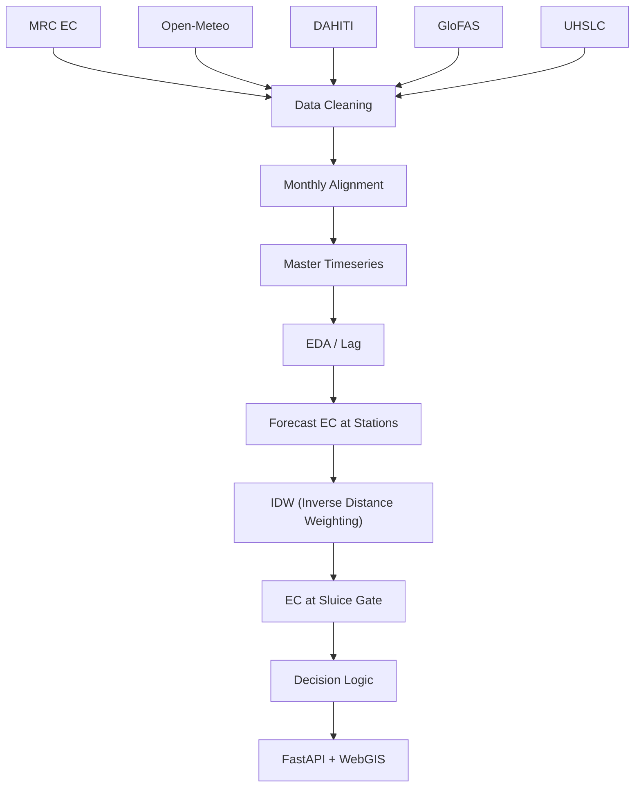

# Research Workflow

```mermaid
graph TD
    %% Input Sources
    MRC["MRC EC"]
    OM["Open-Meteo"]
    DH["DAHITI"]
    GL["GloFAS"]
    UH["UHSLC"]

    %% Data Cleaning
    Clean["Data Cleaning"]
    
    %% Flow
    MRC --> Clean
    OM --> Clean
    DH --> Clean
    GL --> Clean
    UH --> Clean

    Clean --> Align["Monthly Alignment"]
    Align --> Master["Master Timeseries"]
    Master --> EDA["EDA / Lag"]
    EDA --> Forecast["Forecast EC at Stations"]
    Forecast --> IDW["IDW (Inverse Distance Weighting)"]
    IDW --> Gates["EC at Sluice Gate"]
    Gates --> Decision["Decision Logic"]
    Decision --> UI["FastAPI + WebGIS"]
```
